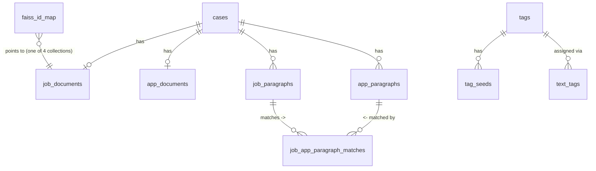

# projektHireMe
# Intro

## motivation

### jobsøgning

**Projekt Hire Me — eller hvordan jeg lærte at avle mine jobansøgninger**
Der er ikke så meget sjovt ved at søge job som ledig. Man skal søge mindst 6 job om måneden, uanset om der overhovedet er så mange relevante opslag at finde — hverken på internettet eller i ens netværk. Som tiden går, bliver det mere og mere repetitivt at formulere, hvor motiveret man er for at arbejde med softwareudvikling inden for netop dén branche man søger ind i, og at beskrive hvordan ens egne kompetencer og kvaliteter matcher dem der efterspørges i opslaget.

Ofte sad jeg med det problem, at jeg allerede mange gange før havde beskrevet, at jeg kunne matche en bestemt efterspurgt kompetence — men i hvilken ansøgning var det nu, jeg skrev det? Det tog ofte længere tid at finde de gamle beskrivelser frem end bare at skrive dem igen. Så som softwareingeniør blev jeg nødt til at automatisere så meget som muligt af disse arbejdsgange i jobsøgningsprocessen.

Med LLM'ers fremgang, og hvor lette de er blevet at tilgå og anvende i dag — også for én der ikke er uddannet direkte i data engineering eller machine learning — er det oplagt at prompt-engineere sig ud af dette slidsomme, manuelle ansøgningsskriveri.

Jeg har altså ikke nøjedes med at gå ét metaniveau op og lave en fast copy-paste-prompt til at generere nye ansøgninger. I stedet har jeg, ved hjælp af agentic coding/vibecoding/chat, udviklet et RAG-setup, som dynamisk sammensætter en prompt skræddersyet til netop dét jobopslag, jeg vil ansøge.

### Forrige arbejdsmetoder
Før dette projekt bestod arbejdsgangen af: manuel samling af tekstbidder fra tidligere ansøgninger ved hjælp af en LLM, samt et lille script der brugte Jaccard-overlap (mængde-lighed mellem ordsæt) til at finde tekstbidder, med en prompt som slutresultat. Begge tilgange krævede stadig, at jeg selv huskede eller ledte efter, hvilke gamle ansøgninger der dækkede hvilke kompetencer — den del automatiserede de ikke.

## Use Case:
Jeg vil som bruger kunne copy-paste teksten fra et jobopslag som input, og som output få returneret en ansøgningstekst, som jeg selv ville have skrevet den.

## Problemstilling:
Hvordan kan tidligere formuleringer i ansøgninger, der matcher bestemte kompetencer og kvaliteter efterspurgt i et givent jobopslag, søges frem, kombineres og genbruges i en ny ansøgning?

### Kerneidé:
Tidligere jobopslag sammen med de ansøgninger, jeg har sendt til dem, betragtes som krav-svar-par. Et RAG-setup udleder kravene i et givent jobopslag, finder matchende krav i de tidligere jobopslag, og returnerer krav-svar-matches som guidende eksempler i den prompt, der gives til en LLM, som skal generere en ansøgning til det nye opslag.

### Tekniske krav:
- I første omgang et script der kan kaldes i terminalen; på sigt en webside-front.
- Offline LLM-inferens, så vidt muligt.
- En vis grad af kvalitet i outputteksten.

### Resourser
- 50+ jobopslag og ansøgninger i krav-svar-par, som RAG-data.
- Softwareudvikler-kompetencer og -erfaring; Python-scripting og SQL er særligt relevante i dette projekt.
- NVIDIA GeForce RTX 3070
- Internet 780 (Mbps)

# Implementering:

## Pipeline:

### Oversigt:

Løsningen, som den ser ud i skrivende stund, er beskrevet herunder, som den pipeline løsningen udgør. De enkelte faser er beskrevet nærmere i [Building](#building):

**1. Ingestion** ([afsnit](#ingestion))
- Gennemgår alle opslag og ansøgninger parvis, som en "case"; søger filer via bestemte navnemønstre.
- Udtrækker ren tekst pr. fil — dels fra `.txt`, mest fra HTML (som jeg har brugt til at generere PDF'er ud fra); trimmer og samler strings.
- Prompter en lokal LLM (Ollama) om at opdele hver tekst i rensede, semantiske hele sætninger 
- Gemmer sætningerne i rækkefølge i en JSON-fil (rækkefølgen er nødvendig senere, når sætningerne skal grupperes i paragraffer).
- Upserter hver case, så allerede behandlede cases ikke duplikeres ved genkørsel.
- Kanonisering: hver case og sætning kanoniseres med et stabilt id.
- Regelbaseret rensning: fjerner kendte boilerplate-/rekrutteringsfraser fra både rå tekst og sætningslister.

**2. Semantic Chunking** ([afsnit](#sematisk-chunking))
- Filtrerer sætninger der er unikt hyppige på tværs af hele tekstkorpusset, via embedding + FAISS self-similarity search.
- Sammenlægger sætninger til semantisk sammenhængende paragraffer — igen via embedding + FAISS self-similarity search, denne gang mellem naboende sætninger.
- Opslagenes og ansøgningernes hele tekster og paragraffer indekseres relationelt.

**3. Persistering i PostgreSQL (system-of-record)** ([afsnit](#persistering-i-postgresql))
- Opretter/synkroniserer tabeller
- Gemmer cases, dokumenter og paragraffer og relationer
- Gemmer de forudberegnede krav→svar-paragrafmatches.
- Gennemgang af tabellerne og deres relationer, samt ER-diagram.

**4. Berigelse** ([afsnit](#berigelse))
- Embedding matching: krav-svar-lighed inden for hver case — opslags- og ansøgningstekst er allerede matchet på case-niveau; anvender embedding similarity til også at beregne ligheden mellem opslags-paragraffer og ansøgnings-paragraffer.
- Tag matching: hardcodede taksonomiske tags med seed-tekst-eksempler til bedre embedding similarity search; beregner taksonomisk tag-lighed via embedding-similaritet; gemmer tags og similarity-scores i databasen.

**5. FAISS-indeksering** ([afsnit](#faiss-indeksering))
- Genererer embeddings for dokumenter og paragraffer i fire Postgres-collections.
- Embedder og L2-normaliserer teksterne pr. collection.
- Bygger ét `IndexFlatIP`-indeks pr. collection og skriver det til disk.
- Gemmer `faiss_id_map`, så en FAISS-position kan slås op til den oprindelige databaserække.

**6. Query-time retrieval** ([afsnit](#retrieval))
- Input: tekstfil med et nyt jobopslag.
- Sætningsopdeler og genbruger paragraf-segmenteringen fra trin 2 til at danne query-paragraffer.
- Kompetence-matching: søger opslaget for ord/varianter fra en fast kompetenceliste.
- Tagger query-teksten mod de samme tag-prototyper som i Berigelse.
- Dokument-niveau retrieval: FAISS-søgning i opslags-tabellen, henter tilhørende hele ansøgning, reranker efter tag-overlap og vector-score.
- Paragraf-niveau retrieval: FAISS-søgning i opslags-paragraf-tabellen pr. query-paragraf.
- Diversitets-udvælgelse: vælger forskellige jobparagraffer og deres bedst matchende svarparagraf, så prompten ikke domineres af ét tema.
- Henter separat korte ansøgnings-paragraffer, der direkte indeholder de matchede kompetenceord.

**7. Promptgenerering** ([afsnit](#promptgenerering))
- Sammensætter den endelige few-shot prompt: nyt jobopslag, tilladt kompetenceliste, korte kompetence-eksempler, hele tidligere eksempler (opslag + ansøgning), krav→svar-paragrafpar.
- Tilføjer guardrails: sprog, tone, stil, kun dokumenterede teknologier, forbud mod opdigtede kompetencer, konkrete formuleringsregler.
- Skriver resultatet til en fil, klar til LLM-inferens.

### Building

#### Ingestion

På dette stadie er dokumenterne allerede filfundet og tekstudtrukket — udfordringen er at normalisere og formatere dataen, så den opfylder de krav, resten af pipelinen stiller: entydige, rene, hele sætninger, gemt i en stabil rækkefølge (rækkefølgen bruges direkte i næste fase til at afgøre, hvilke sætninger der hører sammen i en paragraf).

**Teori.** En sætning lyder som en triviel enhed at få styr på, men fri tekst fra jobopslag og ansøgninger er fyldt med støj: overskrifter uden punktum, opremsninger, forkortelser, kontaktinfo midt i teksten. En simpel regex-splitter på `.`/`!`/`?` knækker let på forkortelser eller overspringer bullet-punkter uden slutpunktum. Derfor bruges her i stedet en lokal LLM til selve sætningsopdelingen — men *kun* til opdelingen, ikke til at omskrive eller opsummere teksten. For at gøre det output brugbart som data (ikke bare læsbar tekst) beder jeg Ollama om et strikt JSON-array af strings (`format`-skema) og sætter `temperature: 0.0`, så samme input konsekvent giver samme output — determinisme er en forudsætning for at kunne bygge en pipeline, man kan stole på og genkøre.

**Ræsonnement — hvorfor en LLM og ikke bare rensning i kode.** Alternativet, en håndrullet regex/NLP-splitter, ville kræve at forudse enhver særskrivning i danske jobopslag (forkortelser, tal, bindestregs-sammensætninger). En LLM med en præcis instruktion generaliserer bedre til den slags uforudsete formatering — så længe instruktionen selv er præcis. Det viste sig at være en pointe i sig selv:

**Praktisk erfaring — "helsætning"-fælden.** Et konkret eksempel fra arbejdsforløbet: da prompten til Ollama første gang bad om at splitte teksten i "sætninger" uden at definere ordet, var modellens fortolkning af hvad der udgør én sætning (fx om en overskrift eller et enkelt bullet-punkt talte som "en sætning") uforudsigelig nok til at give enten for aggressiv eller for konservativ opdeling, samt lejlighedsvis ugyldig JSON. Løsningen var at gøre kravet eksplicit i selve prompten: en sætning er en komplet grammatisk enhed, der slutter med `.`, `?` eller `!`. Det er et lille eksempel på en større pointe, der går igen i hele projektet: ordvalget i en prompt er ikke kosmetik, det er kontraktdefinerende. Samtidig indeholder prompten en liste af eksplicitte udelukkelser — ingen tomme sætninger, ingen ren metadata, ingen URL'er, kontaktinfo, navne, adresser, telefonnumre eller emails — hver af dem en regel, der blev tilføjet fordi modellen ellers happily inkluderede dem.

**Udførelse.**
- `extract_text_from_html()` / `extract_text_from_plain()` / `extract_text()`: en minimal `TextExtractor(HTMLParser)`-klasse, der kun samler tekst inden i `
`-tags og springer indhold i `<script>`/`<style>` over — enkel, men tilstrækkelig, da kildedokumenterne (PDF-eksporterede HTML-filer) konsekvent bruger `
` til brødtekst.
- `find_matching_files()`: rekursiv, case-insensitiv filsøgning via `fnmatch`-mønstre, bruges til at finde opslags- og ansøgningsfilen i hver case-mappe.
- `build_extraction_prompt(text)`: bygger prompten med "hard requirements"-listen beskrevet ovenfor.
- `call_ollama_segmentation()`: POST'er til Ollamas API med `format` sat til et JSON-array-skema og `options: {"temperature": 0.0}`; parser `response`-feltet som JSON og fejler eksplicit (med debug-print) hvis det ikke er gyldig JSON — bevidst fail-fast frem for at gætte på delvist output.
- `process_case_folder(folder)`: orkestrerer én case-mappe — finder job-/app-fil, udtrækker tekst, kalder LLM-segmentering på begge, returnerer et case-objekt.
- `load_existing_cases()` / `upsert_case()`: idempotent upsert-logik i JSON-filen, så en genkørsel ikke duplikerer allerede behandlede cases (matcher/overskriver på case-navnet).

#### Sematisk Chunking

Kanonisering (case- og sætnings-id'er), embedding, chunking og støjfjernelse sker alt sammen i dette ene script — `cleanup_canonicalize_semanticchunkify.py` — selvom kanonisering og den regelbaserede rensning konceptuelt hører til Ingestion-fasen ovenfor.

**Teori — vektor, embedding, cosine similarity.** En vektor er her ikke andet end en bestemt rækkefølge af tal, fx `[0.12, -0.45, 0.88, …]`. En embedding-model omdanner en hel sætning til præcis sådan én vektor — tekstens numeriske "fingeraftryk" i et flerdimensionelt rum, hvor tekster med lignende betydning ligger tæt på hinanden. Cosine similarity er afstanden mellem to sådanne vektorer udtrykt som en vinkel: når man L2-normaliserer vektorerne først (skalerer dem til længde 1), bliver et simpelt prikprodukt (`dot product`) mellem dem lig med cosine similarity — 1 betyder identisk retning (meget lignende), 0 betyder ingen sammenhæng. Dette "normalisér først, tag så dot product"-mønster går igen konsekvent i hele kodebasen (her, i `build_faiss_indexes.py`, og i `tag_assignment.py`) og er selve grunden til at FAISS-indekset senere kan bruge et almindeligt inner-product-indeks til at udregne cosine similarity.

**Teori — hvorfor chunking, og hvorfor ikke arbitrær chunking.** Chunking betyder at dele lang tekst op i mindre stykker, så retrieval bliver mere præcist og LLM'ens kontekst mindre støjet af irrelevant indhold. Den mest almindelige RAG-tilgang er arbitrær chunking: fast antal tegn eller tokens pr. chunk, uafhængigt af indhold. Det er ikke oplagt her, fordi jobopslag og ansøgninger i dette projekt er korte dokumenter (typisk nogle hundrede ord) — en fast tegn-vindue-chunking ville ofte skære midt i en sætning eller blande to urelaterede emner sammen i én chunk. Løsningen er i stedet at arbejde med sætningen som den mindste enhed (allerede sikret i Ingestion) og derefter gruppere sætninger til paragraffer ud fra deres *semantiske sammenhæng* snarere end en fast længde.

**v1 — naiv chunking + heldokument-embedding-match.** Det første forsøg embeddede hele dokumenter/paragraffer og matchede dem direkte. Det virkede — systemet fandt faktisk relevante uddrag fra databasen — men blandt de bedste matches optrådte også eksempler, der tydeligvis ikke var reelt relevante. Det afslørede en central indsigt: embedding som metode til at sammenligne tekst skal ikke gøres til mere, end det egentlig er — en kvantificering af *hele* teksten, intet mere, intet mindre. Den semantiske mening trækkes ud af modellen, men maskinen deler ikke nødvendigvis udviklerens eller brugerens opfattelse af, hvad der er semantisk vigtigt. Derfor fandt systemet tekster der "lød" ens, ikke kun tekster med sammenlignelige arbejdsopgaver — rekrutterings-lingoen ("vi tilbyder", "et godt arbejdsmiljø") lyder også ens på tværs af helt urelaterede jobopslag, og den tæller med i similarity-scoren, medmindre man enten fjerner fokus fra den (rensning) eller flytter fokus over på mere fagligt relevant mening (tags, se Berigelse).

**Udførelse.**

`remove_phrases`-listen: en regex-liste over kendte danske rekrutterings-/boilerplate-fraser ("send os en ansøgning", telefonnumre, URL'er, "med venlig hilsen", "cpr-nummer", "frokostordning"/"massageordning"/"pensionsordning", ligestillings-boilerplate m.fl.) — en billig, regelbaseret første rensning, før den dyrere statistiske rensning nedenfor.

`cleanup(cases_json, embeddingmodel)`:
- fjerner sætninger der matcher `remove_phrases` fra både sætningslister og rå tekst (erstattes med `" [] "`);
- tildeler hver case et `case_id` (`"c" + index`) — kanonisering;
- **corpus-wide distinctiveness-filtrering**: samler alle `job_sentences` på tværs af *alle* cases i én flad liste med et `flatID_to_caseID_mapping`, embedder dem alle, bygger ét `faiss.IndexFlatIP` over hele listen, og selv-søger hver sætning mod sine `k=50` nærmeste naboer;
- for hver sætning tælles, hvor mange forskellige cases der har en næsten-identisk match (similarity ≥ 0.85), og `distinctiveness = 1.0 - (antal matchende cases / samlet antal cases)`;
- er en sætnings distinctiveness under 0.9, fjernes den — den er med andre ord for generisk/hyppig på tværs af hele korpusset til at være informativ (en statistisk, embedding-baseret udgave af samme idé som regex-listen ovenfor, blot uden en hardcodet fraseliste).

`paragraphize(cases_json, embeddingmodel)` — den semantiske sammenlægning af sætninger til paragraffer, i praksis en simpel "TextTiling"/discourse-segmenterings-tilgang:
- `consecutive_semantic_coherence(embeddings)`: for hvert par af *naboende* sætnings-embeddings beregnes `dot(embeddings[i-1], embeddings[i])` — cosine similarity, da vektorerne allerede er L2-normaliserede. Resultatet er en talrække af "hvor sammenhængende er sætning i med sætning i-1".
- `moving_average(values, smooth_window=5)`: glatter denne talrække med et centreret glidende gennemsnit, så enkeltstående støjdyk ikke udløser en unødvendig paragrafgrænse.
- `find_local_minima(values, threshold)`: finder de indekser, hvor den glattede similarity-række har et lokalt minimum — et "knæk" hvor naboende sætninger pludselig er mindre similar end deres omgivelser. Et sådant knæk tolkes som grænsen mellem to meningsfulde paragraffer, fordi det er dér, emnet skifter.
- `paragraphize_sentences(sentences, source, case_id)`: kæder det sammen — embedder sætningerne, beregner gaps, finder minima, og skærer sætningslisten i paragraffer ved disse grænsepunkter; hver paragraf får et `paragraph_id` som `c{n}_{job|app}_p{n}`.
- Køres én gang for `job_sentences` og én gang for `app_sentences` pr. case; de flade sætningslister fjernes derefter fra case-objektet og erstattes af paragraf-strukturen.

#### Berigelse

Efter v1's diagnose (embedding alene finder tekster der lyder ens, ikke nødvendigvis tekster der reelt matcher fagligt) er systemet nødt til at understøtte RAG-forespørgslen med mere end rå embedding-similarity — dels en persisteret model for "hvilket svar passer bedst til hvilket krav", dels en model for "handler disse to tekster overhovedet om det samme". To uafhængige, komplementære former for match beregnes derfor her.

**Ræsonnement — hvorfor tag-matching blev nødvendig.** Et konkret eksempel under udviklingen viste problemet tydeligt: en sætning om "PET" (politiets efterretningstjeneste) blev embedding-matchet højt op mod en sætning om "MinRefusion" (et fagsystem) — to helt urelaterede domæner, der blot delte overfladisk sprogbrug/genre. En ren embedding-similarity-score kan ikke i sig selv skelne mellem "de her to tekster ligner hinanden i stil" og "de her to tekster handler om det samme emne". Løsningen er en lukket, håndskrevet taksonomi af tags — et fast, kontrolleret vokabular, som ikke kan snydes af overfladisk sproglig lighed på samme måde som fri embedding-similarity kan.

**Taksonomisk tagging.**

Spørgsmålet et tag besvarer er: *"Handler disse to tekster overhovedet om samme emne/domæne?"* (Python vs. cybersikkerhed vs. salg) — et diskret, kategorisk svar, robust over for stilforskelle. Et tag som "programmeringssprog" er sandt, uanset om teksten er formuleret som et krav i et opslag eller som en erfaring i en ansøgning — hvor embedding-similarity ville kunne variere en del bare på formuleringens stil.

- Henter alle tags + seed-eksempler fra Postgres, og indlæser `tags_taxonomy.json` (top-kategorier → tags → `seed_examples`) som kilden til, hvilke tags der overhovedet findes.
- Bygger én **prototype-embedding** pr. tag: i stedet for at gemme mange arbitrære eksempeltekster pr. tag, embeddes et lille antal håndskrevne "seed"-sætninger, og deres embeddings L2-normaliseres og gennemsnitliggøres (og renormaliseres) til én enkelt, repræsentativ vektor pr. tag.
- Henter alle dokumenter og paragraffer (job/app) fra Postgres som "targets" og embedder dem.
- Beregner cosine similarity mellem hver target og alle tag-prototyper, grupperet pr. top-kategori, og beholder kun top-k tags pr. kategori over en minimumsscore — en tekst kan altså få flere tags samtidig, fx ét inden for "teknisk_kompetence" og ét inden for "virksomhedskultur".
- Sideværktøj: `evaluate_tag_seed_similarity.py` bruger nøjagtig samme mekanik (seed-embeddings mod tekst-embeddings), men udelukkende til at diagnosticere og finjustere selve taksonomien — fx opdage om to seeds ligger for tæt på eller for langt fra hinanden — og er bevidst ikke en del af selve produktionspipelinen.

*Funktionsgennemgang (`tag_assignment.py`):* `fetch_tags_from_db()` henter tags+seeds; `build_tag_prototypes()` udfører "normalisér-gennemsnit-renormalisér"-beregningen ovenfor; `fetch_targets()` samler alle job/app-dokumenter og -paragraffer i én flad `(target_type, target_id, text)`-liste; `embed_texts()` embedder og L2-normaliserer; `assign_tags_to_embeddings()` beregner hele similarity-matricen (alle targets × alle tags) i ét `matmul`, og udvælger top-k pr. kategori over min_score; `persist_text_tags()`/`persist_all_text_tags()` skriver rækkerne til `text_tags`.

**embedding similarity matching.**

Spørgsmålet embedding-similarity besvarer, når to tekster allerede er inden for samme case, er anderledes end tag-matchets: *"Hvor specifikt/stærkt besvarer denne ene sætning netop dette ene krav?"* — en kontinuerlig score, der fanger nuancer inden for samme tag-kategori. To tekster kan begge være tagget "Python-erfaring", men "5 års Python-erfaring i finansielle systemer" matcher alligevel bedre til et FinTech-Python-krav end "lidt Python i et skoleprojekt" — den forskel fanges kun af den kontinuerlige similarity-score, ikke af tagget alene.

- Beregner embedding-similarity mellem alle job- og app-paragraffer **inden for samme case**, og gemmer top-N (default 3) bedste ansøgnings-matches pr. jobparagraf i `job_app_paragraph_matches` — den forudberegnede "krav → mit svar"-kobling, som senere slås op direkte ved query-tid i stedet for at blive genberegnet.

**Ræsonnement — hvorfor kun inden for samme case.** At begrænse denne beregning til én case ad gangen (ikke hele korpusset) er bevidst: antagelsen er, at inden for én allerede matchet case er en jobparagraf og den/de sætninger i den tilhørende ansøgning, der besvarer netop det krav, den mest pålidelige grundsandhed, systemet har til rådighed — fordi et menneske (mig selv) faktisk brugte den ansøgning til at besvare netop det opslag.

*Funktionsgennemgang (`persist_texts_paragraphs.py::persist_paragraph_matches()`):* pr. case embeddes alle `job_paragraphs` og `app_paragraphs`, normaliseres manuelt med numpy (`vectors /= np.clip(norm, 1e-8, None)` — clip'et undgår division med nul for en evt. nul-vektor), og hele similarity-matricen beregnes i ét `job_vectors @ app_vectors.T`; for hver jobparagraf udvælges de top-N app-paragraffer med højest score via `np.argsort(...)[::-1][:top_n]`, og gemmes med en `rank`.

#### Persistering i PostgreSQL

PostgreSQL er systemets "system of record": de faktiske tekster, id'er og relationer ligger her, og kan ikke uden videre genskabes, hvis de mistes. FAISS-indeksene (næste fase) er derimod bevidst behandlet som en flygtig, genopbyggelig afledning af data i Postgres — de kan til enhver tid slettes og genopbygges fra databasen, men ikke omvendt. Alle scripts, der skriver til Postgres, er skrevet idempotent (`ON CONFLICT ... DO UPDATE`), så en genkørsel aldrig skaber dubletter.

Nogle felter i skemaet — fx `tags_json`/`style_signals_json` på `job_paragraphs`/`app_paragraphs` i det officielle skema — står reelt tomme, fordi de faktiske tags i stedet lever i den mere fleksible `text_tags`-tabel (en normaliseret, polymorf kobling frem for en indlejret JSON-kolonne på selve raden). Det er et lille stykke skema-gæld: kolonnen blev designet ind tidligt "i tilfælde af", men den funktionalitet endte med at få sin egen tabel i stedet.

**Tabeloversigt.**

- `cases` — én række pr. case (jobopslag + ansøgning som ét par).
- `job_documents` / `app_documents` — hele rå-teksten pr. case, 1:1 med `cases`.
- `job_paragraphs` / `app_paragraphs` — de semantisk segmenterede paragraffer, 1:N pr. case.
- `job_app_paragraph_matches` — krav→svar-koblingen: `(job_paragraph_id, app_paragraph_id, similarity_score, rank)`, top-N pr. jobparagraf.
- `taxonomy_metadata`, `tags`, `tag_seeds` — selve taksonomien, synkroniseret fra `tags_taxonomy.json`.
- `text_tags` — den polymorfe kobling mellem en hvilken som helst tagget tekstenhed (`target_type`/`target_id`) og et tag, med score og `rank_in_category`.
- `faiss_id_map` — bro-tabellen mellem en FAISS-indeksposition og den oprindelige Postgres-række (se næste fase).

**Udførelse.**

- `persist_tags_taxonomy.py`: upserter tags/seeds fra `tags_taxonomy.json` og rydder op i tags/seeds der ikke længere findes i filen (`DELETE ... WHERE NOT (tag_key = ANY(%s))`), så databasen aldrig driver væk fra taksonomi-filen.
- `persist_texts_paragraphs.py`: upserter `cases`, `job_documents`/`app_documents`, `job_paragraphs`/`app_paragraphs`, og kalder derefter `persist_paragraph_matches()` (se Berigelse) for at fylde `job_app_paragraph_matches`.
- `tag_assignment.py`: opretter `tags`/`tag_seeds`/`text_tags`, og gemmer det endelige resultat af tagging-fasen i `text_tags`.

#### FAISS-indeksering

**Teori — fra tekst til søgbar vektor.** Kæden fra rå tekst til noget, man kan sammenligne tal-for-tal, går i store sprogmodeller typisk via: tekst → tokenizer → tokens (mindste tekst-enheder modellen regner med, ofte dele af ord) → token-id'er → en embedding-matrix der slår hvert token-id op som en vektor → transformer-lag der bearbejder tokenvektorerne i kontekst af hinanden. En *sentence embedding*-model (her en flersproget SentenceTransformer) gør noget lidt andet med det sidste trin: i stedet for at returnere én vektor pr. token, samler (poolers) den token-vektorerne til **én enkelt, fast-størrelse vektor for hele input-strengen** — det er den vektor, der gemmes og søges i, ikke token-vektorerne.

**Teori — hvad er FAISS.** FAISS (Facebook AI Similarity Search) er et bibliotek bygget specifikt til hurtig nearest-neighbor-søgning blandt store mængder vektorer. At gøre det "i hånden" med numpy (sammenligne en query-vektor mod hver gemt vektor én for én, eller ét stort matrix-produkt) er faktisk fuldt ud brugbart ved dette projekts skala (nogle tusinde vektorer) — men FAISS er standardværktøjet, der også skalerer til millioner af vektorer, og som giver et ensartet API til at bygge, gemme, indlæse og søge et indeks, uanset datamængde.

`IndexFlatIP` er den simpleste indekstype i FAISS: et eksakt (ikke-approksimeret), brute-force-indeks, der rangerer efter **inner product** (prikprodukt). Kombineret med at hver vektor L2-normaliseres før den tilføjes/søges (`faiss.normalize_L2`), bliver inner product matematisk identisk med cosine similarity — hvilket er hele grunden til, at normalisering sker konsekvent hver gang, en tekst embeddes nogen steder i denne kodebase.

**Ræsonnement — hvorfor fire separate indeks.** I stedet for ét stort, fælles indeks bygges der fire adskilte collections: `job_documents`, `app_documents`, `job_paragraphs`, `app_paragraphs`. Det er en direkte konsekvens af v1's erfaring (se Semantisk Chunking): blander man jobopslag og ansøgninger, eller hele dokumenter og paragraffer, i samme indeks, kan genre og længde dominere similarity-scoren frem for reel faglig relevans. Adskilte collections pr. (dokumenttype × granularitet) sikrer, at sammenligninger altid sker "samme genre mod samme genre".

**Udførelse.**

- `COLLECTIONS`-dict'en kobler hver af de fire collections til dens Postgres-tabel og tekstkolonne.
- `fetch_rows()`: henter `(id, text)` i stabil rækkefølge (`ORDER BY id`) — rækkefølgen er vigtig, fordi en rækkes FAISS-position bogstaveligt er dens plads i denne liste (0, 1, 2, …).
- `embed_texts()`: batch-encoder med SentenceTransformer, caster til `float32` (FAISS' forventede datatype), og L2-normaliserer.
- `persist_index()`: bygger et frisk `IndexFlatIP(dim)`, tilføjer alle vektorer, skriver det atomisk til disk (skriv til en `.tmp`-fil, derefter `os.replace` — undgår nogensinde at efterlade en halvskrevet indeksfil, hvis processen dør midt i skrivningen), og genskriver derefter `faiss_id_map` for den collection: sletter gamle rækker og indsætter `(collection, source_table, source_id, faiss_index, embedding_model)`, så hver FAISS-position 0..N-1 kan spores tilbage til en Postgres-række.
- `ensure_faiss_id_map()`: opretter mapping-tabellen hvis den mangler, med unikke constraints på både `(collection, faiss_index)` og `(collection, source_table, source_id)` — for at forhindre dubletter eller forældreløse mappinger.
- `build_indexes()`: kører de fire collections igennem, én ad gangen.

### QUERY time

#### retrieval

Her bliver asymmetrien mellem jobopslag ("spørgsmål") og ansøgning ("svar") konkret: retrieval er ikke ét embedding-similarity-opslag, men flere adskilte opslag, der hver besvarer et andet spørgsmål, som derefter kombineres og rangeres — fordi intet enkelt "ligner dette"-signal er tilstrækkeligt alene.

To granulariteter bruges parallelt: **dokument-niveau** ("hvilken af mine tidligere ansøgninger læser bedst som en stilistisk skabelon til dette nye opslag") og **paragraf-niveau** ("hvilket tidligere krav ligner netop dette nye krav mest, og hvad svarede jeg dengang"). At `job_app_paragraph_matches` blev forudberegnet offline i Berigelse-fasen er præcis, hvad der gør dette trin til et billigt SQL-opslag i stedet for en dyr live-similarity-beregning mellem hver jobparagraf og hver app-paragraf i hele korpusset.

**Ræsonnement — diversitets-udvælgelse.** Uden yderligere filtrering kunne de bedste tag-overlap/vector-score-matches alle stamme fra samme jobparagraf eller samme tema — hvilket ville gøre de endelige few-shot-eksempler i prompten repetitive og skæve mod ét emne i stedet for at dække det nye opslags flere forskellige krav. Da antallet af paragraf-eksempler, prompten har råd til, er begrænset (jf. context-window-budgettet nedenfor), skal hver "plads" i prompten helst dække et *forskelligt* krav frem for nær-dubletter af samme krav. Løsningen: gruppér kandidatpar efter `job_paragraph_id`, behold kun distinkte jobparagraffer (rangeret efter `job_tag_overlap` → `vector_score`), og vælg for hver af dem uafhængigt den bedst matchende app-paragraf (efter `app_tag_overlap` → `mapping_score` → `vector_score`).

**Ræsonnement — kompetence-matching ved siden af tag/embedding.** Tag- og embedding-laget er bevidst fuzzy og probabilistisk — en styrke, fordi det generaliserer til formuleringer, systemet ikke har set før, men en svaghed, hvis man skal *garantere*, at et specifikt, konkret ord (fx "Kubernetes" eller "Scrum") bliver genkendt som til stede. En lille, håndholdt, deterministisk keyword-liste (`kompetencer_og_erfaringer_tags.txt`) lukker det hul: den giver LLM'en en eksplicit, forsvarlig "whitelist" af ord, den må bruge — samme guardrail-tankegang som i Promptgenerering, blot fra den modsatte vinkel: i stedet for kun at *forbyde* opdigtede ord, *licenserer* denne liste aktivt de ord, der reelt findes i det nye opslag.

Dansk sammensætning og bøjning håndteres pragmatisk i stedet for med en fuld lemmatizer: danske sammensatte ord skrives sammen uden mellemrum eller bindestreg ("softwareudvikling" indeholder "udvikling"), så en substring-match på en whitespace-/tegn-renset, casefoldet streng fanger de fleste tilfælde billigt, suppleret med simple ental/flertal-varianter (fx afprøv både med og uden trailing "-er"/"-s").

**Funktionsgennemgang (`search_job_application_rag.py`).**

- `split_sentences()`: en let regex-baseret sætningssplitter for query-teksten (bruges før teksten sendes gennem den *samme* `paragraphize()` som ved ingestion).
- `make_query_paragraphs()`: pakker inputteksten ind i et falsk, enkelt "case"-objekt der matcher den form, `paragraphize()` forventer — så nøjagtig samme semantiske chunking-logik fra fase 2 håndterer det nye, usete opslag.
- `find_competency_matches()`: normaliserer kompetencelisten (casefold, tegnoprydning, simpel ental/flertal-variantgenerering) og substring-matcher varianterne mod en tilsvarende renset udgave af query-teksten.
- `fetch_competency_app_paragraphs()`: et SQL `LIKE`-opslag (bygget af samme normaliserede varianter) mod `app_paragraphs`, sorteret efter tekstlængde stigende — det korteste, mest præcise matchende eksempel vinder først, hvilket holder disse few-shot-eksempler korte (jf. context-budget).
- `load_query_tags()`: genberegner tag-prototyper on-the-fly fra Postgres (samme matematik som `tag_assignment.build_tag_prototypes`) og vælger top-k tags pr. kategori for den nye tekst.
- `fetch_faiss_hits()`: den generiske FAISS→Postgres-bro — søger et indeks, og slår derefter hver hit-position op i `faiss_id_map` for at oversætte den tilbage til en reel `(tabel, id)`.
- `fetch_document_hit()` / `fetch_paragraph_hit()` / `fetch_tags()` / `fetch_mapped_app_paragraphs()`: tynde Postgres-opslag der "hydrerer" FAISS-hits til faktisk tekst, tags og forudberegnede matches.
- `search()`: den orkestrerende funktion — samler query-paragraffer, kompetence-matches og query-tags; søger `job_documents`-indekset (dokument-niveau, reranket efter tag_overlap/vector_score); søger `job_paragraphs`-indekset pr. query-paragraf; slår forudberegnede app-match-kandidater op pr. hit; grupperer alle kandidater efter `job_paragraph_id`; udvælger for hver gruppe den bedste job-side (`job_tag_overlap`, `vector_score`) og den bedste app-side (`app_tag_overlap`, `mapping_score`, `vector_score`) uafhængigt af hinanden; sorterer og skærer til `paragraph_k`.

#### promptgenerering

**Teori — context window og token-budget.** Hver eneste bid, der er hentet frem ovenfor (kompetenceliste, korte kompetence-eksempler, hele dokumenter, paragrafpar), konkurrerer om det samme token-budget i prompten. En LLM's kontekstvindue er ikke uendeligt, og indhold placeret midt i en meget lang prompt har en dokumenteret tendens til at blive "glemt" eller vægtet lavere af modellen ("lost in the middle") sammenlignet med indhold i starten eller slutningen. Det er den direkte begrundelse for, at `document_k` som standard er sat lavt (1) og `paragraph_k` moderat (5) — ikke fordi flere eksempler ikke kunne være nyttige i teorien, men fordi hvert ekstra eksempel har en pris i kontekstplads og opmærksomhed.

**Ræsonnement — guardrails mod hallucination.** "Hard requirements"-blokken i `build_prompt()` er den konkrete implementering af en gennemgående lære fra hele forløbet: en LLM skal eksplicit fortælles, hvad den *ikke* må gøre, lige så præcist som hvad den skal. Konkrete regler i den nuværende prompt — aldrig brug tankestreger (—), undgå omstændelige metaformuleringer som "stillingen kombinerer noget, jeg er motiveret af", undgå spejlende fraser som "det matcher jeres behov", undgå selvnedvurderende formuleringer som "jeg kommer ikke med en tung profil" — er hver især eksempler på prompt-engineering-ved-iteration: regler der blev tilføjet, fordi LLM'en produktivt gentog et bestemt uønsket mønster, indtil det blev forbudt eksplicit. Det er samme kategori af erfaring som "helsætning"-historien fra Ingestion, bare opdaget senere i pipelinen.

Guardrailen har to sider, der begge er med: et *forbud* (opfind aldrig teknologier/kompetencer/erfaring, der ikke er dokumenteret i kildeteksterne) og en *tilladelse* (den eksplicitte kompetence-whitelist fra retrieval-fasen, som aktivt licenserer bestemte ord). Det er værd at være ærlig om, at den content/style/rejected-tredeling, der oprindeligt var tanken bag guardrails, i den nuværende implementering udmøntes som tekstlige instruktioner i prompten frem for som en bogstavelig tredelt eksempel-struktur.

**Funktionsgennemgang.**

- `build_prompt()`: ren strengsammensætning — sætter `full_document_examples` sammen til blokke af "tidligere opslag + tidligere ansøgning", `paragraph_examples` til krav→svar-par, `competency_matches` til en punktopstilling (med et eksplicit fallback-linje hvis listen er tom: "Ingen direkte kompetence-match fundet."), og `competency_app_paragraphs` til korte eksempler — alt sammen pakket ind i den faste instruktions-skabelon med de navngivne sektioner (`=== NYT JOBOPSLAG ===`, `=== MATCHENDE KOMPETENCER, FÆRDIGHEDER OG KVALITETER ===`, osv.).
- `main()`: CLI-indgangspunktet — læser jobtekstfilen, indlæser embedding-modellen én gang, åbner Postgres-forbindelsen, kalder `search()`, og skriver `result["few_shot_prompt"]` til `generated_prompt.txt`.

#### Fremtidigt / endnu ikke implementeret

- Selve LLM-inferencen på den genererede prompt (lokal, offline) — endnu ikke koblet på; pipelinen stopper i dag ved `generated_prompt.txt`.
- **Asymmetrisk embedding** via instruktions-prefix (`query:`/`passage:`, som i fx E5/BGE/GTE-modeller) for bedre krav→svar-matching. Dette er reelt "rod-fixet" til den asymmetri, hele Berigelse- og retrieval-fasen i dag kompenserer for med tags og forudberegnede matches: et jobkrav og et ansøgnings-svar er ikke symmetriske tekster (spørgsmål vs. svar), men embeddes i dag med samme model uden retningsspecifik instruktion. En asymmetrisk model, der embedder krav som "query" og svar som "passage", kunne potentielt reducere behovet for dele af tag-laget — men er ikke afprøvet endnu.
- Justering af k-værdier og similarity-thresholds (foreløbig sat ud fra stikprøver, ikke systematisk evalueret).
- Eksport af den færdige ansøgningstekst til PDF (fx via Puppeteer).
